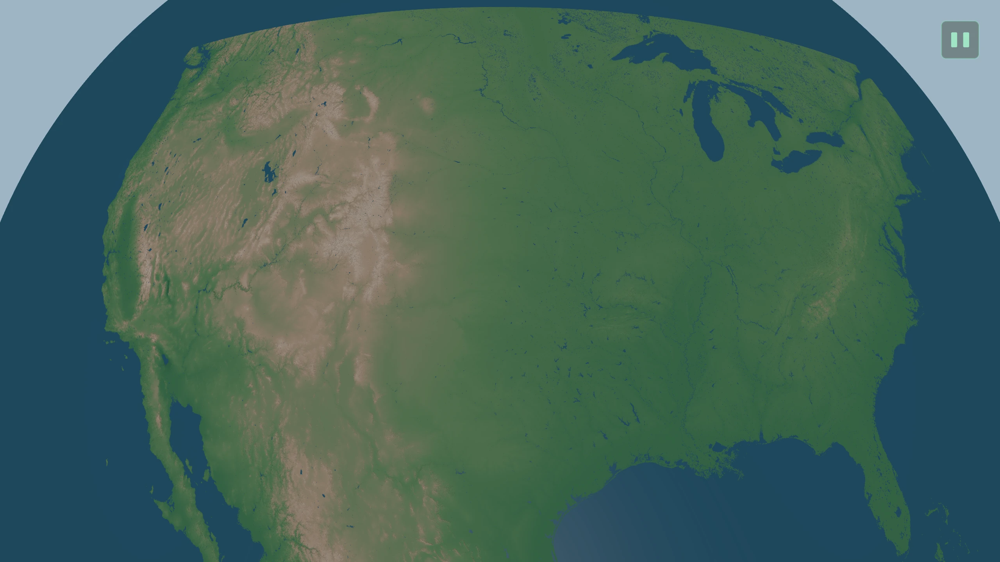
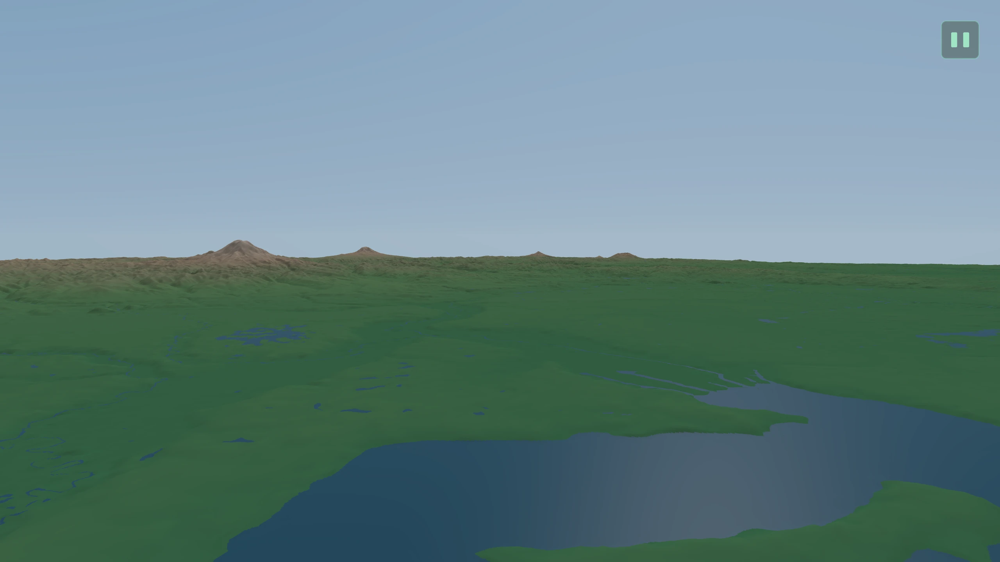
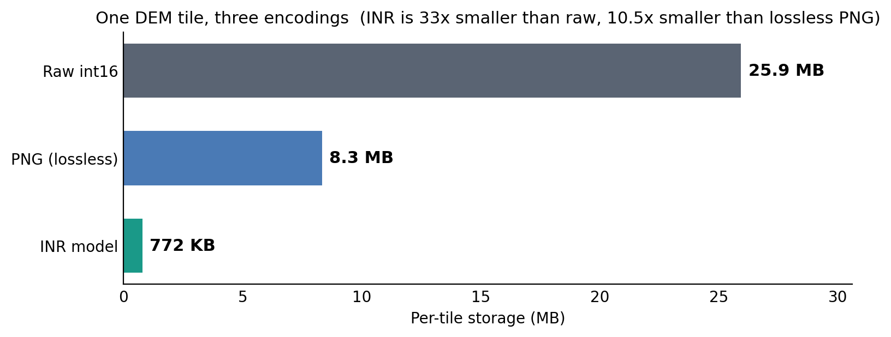
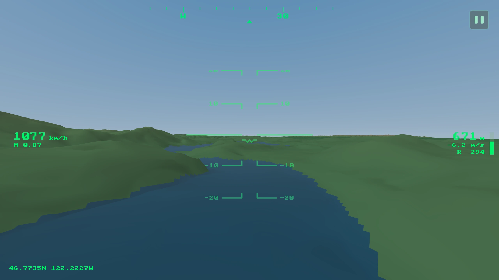
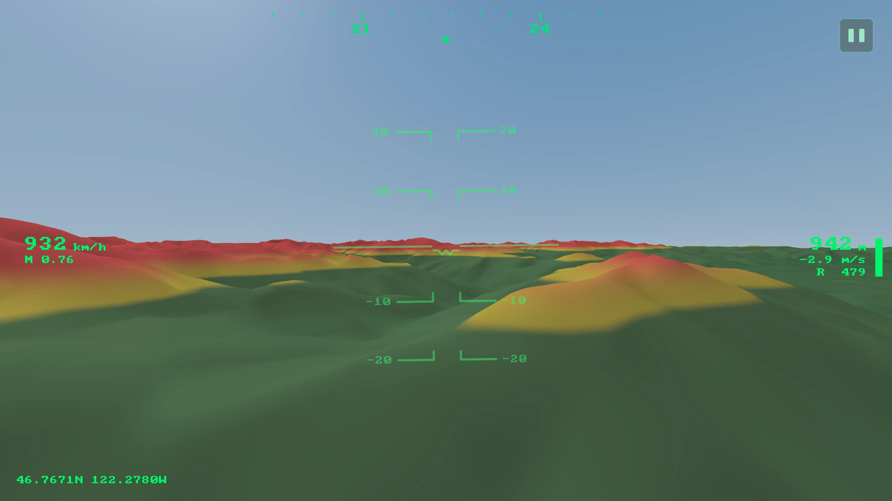
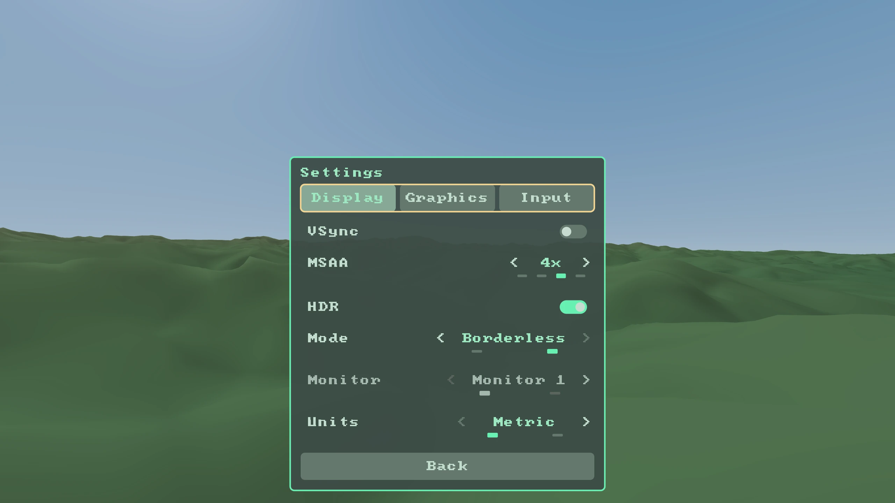

# tinrs - Terrain Implicit Neural Representation Simulation

Neural compression of terrain elevation data using Implicit Neural Representations
(INRs). Each 1-degree DEM tile is replaced by a tiny per-tile neural network that
reconstructs elevation, water, and surface normals, evaluated directly on the GPU
by a compute shader and fed to a geometry-clipmap renderer with a synthetic-vision
HUD.

Originally based on [srg-synvis](https://github.com/cs-wwu/srg-synvis), an RPi
5-constrained aviation synthetic vision system.



The same renderer at low level over Puget Sound (tile `n47w122`):



## What it does

Each 1-degree DEM tile (3600x3600 elevation samples, ~26 MB raw) is compressed into
a ~771 KB neural network that reconstructs elevation, water classification, and
surface normals at arbitrary coordinates. A Vulkan compute shader evaluates the
network on-GPU, so there is no tile-decode-mesh step in the hot path.

**Current results** (37-tile PNW region, 500K steps):

| Metric          | Value        |
| --------------- | ------------ |
| RMSE range      | 0.16-6.36m (all < 7m) |
| Mean RMSE       | ~3.9m        |
| Normal accuracy | 1-4 deg mean |
| Water IoU       | 0.84-1.00    |
| Model size      | 771 KB/tile  |
| Compression     | ~34:1 vs raw |



For context, consumer GPS vertical accuracy is ~7m (1-sigma), so the INR
compression error sits below the dominant error source in the system.

## Synthetic-vision HUD

The viewer draws a synthetic-vision HUD over the terrain: a heading ribbon,
conformal attitude horizon and pitch ladder, altitude / speed / vertical-speed
readouts, and a GPU-resident AGL probe. An optional **TAWS** overlay tints terrain
red/yellow by clearance below the aircraft (Garmin SVT style).





## Architecture

**Feature Plane + Tiny MLP**: a learned 2D feature grid (256x256, 12 features/cell)
with bilinear interpolation, decoded by a 2-layer ReLU MLP (12 -> 48 -> 4). Four
outputs: elevation, water logit, dx gradient, dy gradient.

```
coords (x, y)
    -> bilinear grid sample -> 12 features
    -> Linear(12, 48) -> ReLU -> Linear(48, 4)
    -> [elevation, water_logit, dx, dy]
```

Grid features are INT8 quantized (4x compression); MLP weights are float32
(~3.2 KB). Total ~771 KB/tile.

Why this architecture:

- **Single texture read** per evaluation (vs 5-7 for multi-resolution grids)
- **~768 MACs/point**, fits the RPi 5 compute budget
- **Zero hash collisions**: every grid cell stores exactly what that region needs
- **Learned normals**: dx/dy gradient outputs give smooth surface normals with no
  finite differences or analytical backward pass
- **Smooth water boundaries**: a sigmoid output gives continuous probabilities, no
  staircase artifacts

## Try it

### Viewer (Zig + Vulkan)

Requires **Zig 0.16** and a **Vulkan 1.2+** driver (and SDL3 development libraries
to build from source).

```bash
cd viewer
zig build run                 # windowed; loads the bundled n47w122 sample model
zig build run -- --procedural # procedural terrain, no model needed
```

A bundled ~771 KB `n47w122` model ships in `assets/planes/`, so the viewer renders
real terrain out of the box. See **[`viewer/README.md`](viewer/README.md)** for the
full controls (keyboard / gamepad / mouse / touch) and command-line flags.



### Training (Python)

Requires Python 3.13+, PyTorch 2.10+, managed with [uv](https://github.com/astral-sh/uv).

```bash
# Download GLO-30 tiles for a bounding box
uv run python training/download_glo30.py --bbox 47,-123,48,-122

# Train one tile (produces a .pt checkpoint + exported weights for the viewer)
uv run python training/train_plane.py --tile n47w122 --amp

# Batch-train every tile in a directory
uv run python training/train_plane.py --tile-dir glo30 --amp
```

Exported weights land in `assets/planes/<tile>/`, which is exactly what the viewer
loads.

## Platform support

The viewer has been run on Linux (Fedora, Debian) and Windows, across AMD, NVIDIA,
and Broadcom VideoCore (Raspberry Pi) GPUs plus several integrated GPUs (including
modern Intel). macOS is untested but should work via MoltenVK.

## Project structure

```
training/           Python training code
  train_plane.py      Production trainer + exporter (feature-plane architecture)
  train.py            Unified trainer (all architectures, for reproducibility)
  models.py           INR architectures (SIREN, BACON, Hash, Feature Plane, MGrid)
  download_glo30.py   Fetch GLO-30 DEM tiles by bbox

viewer/             Zig + Vulkan terrain viewer (see viewer/README.md)
  src/                Clipmap renderer with compute-shader INR evaluation
  shaders/            GLSL compute / vertex / fragment shaders

assets/
  planes/n47w122/     Bundled sample model (~771 KB), so the viewer runs out of the box
  planes/<tile>/      Your exported models (gitignored)
  maps/glo30/         GLO-30 DEM tiles (gitignored; fetch with download_glo30.py)
```

## Data sources

- **Elevation**: [Copernicus GLO-30 DEM](https://spacedata.copernicus.eu/collections/copernicus-digital-elevation-model).
  30m resolution, float32 GeoTIFF, EGM2008 vertical datum. Global coverage to 83 deg N.
- **Water**: GLO-30 Water Body Mask (WBM). Used as a training target, not stored at runtime.

## References

### Core INR
- Sitzmann et al., "Implicit Neural Representations with Periodic Activation Functions," NeurIPS 2020 (SIREN). https://www.vincentsitzmann.com/siren/
- Mueller et al., "Instant Neural Graphics Primitives with a Multiresolution Hash Encoding," SIGGRAPH 2022. https://nvlabs.github.io/instant-ngp/
- Lindell et al., "BACON: Band-limited Coordinate Networks for Multiscale Scene Representation," CVPR 2022. https://arxiv.org/abs/2112.04645
- Dupont et al., "COIN++: Neural Compression Across Modalities," 2022. https://arxiv.org/abs/2201.12904

### Compression and grids
- Kim & Fridovich-Keil, "Grids Often Outperform Implicit Neural Representation at Compressing Dense Signals," NeurIPS 2025. https://arxiv.org/abs/2506.11139
- Girish et al., "SHACIRA: Scalable Hash-grid Compression for Implicit Neural Representations," ICCV 2023. https://shacira.github.io/
- Vaidyanathan et al., "Random-Access Neural Compression of Material Textures," SIGGRAPH 2023 (NVIDIA NTC). https://research.nvidia.com/labs/rtr/neural_texture_compression/
- Reiser et al., "MERF: Memory-Efficient Radiance Fields for Real-time View Synthesis," SIGGRAPH 2023. https://creiser.github.io/merf/

### Terrain rendering and terrain INR
- Losasso & Hoppe, "Geometry Clipmaps: Terrain Rendering Using Nested Regular Grids," SIGGRAPH 2004. https://hhoppe.com/geomclipmap.pdf
- Asirvatham & Hoppe, "Terrain Rendering Using GPU-Based Geometry Clipmaps," GPU Gems 2, 2005. https://developer.nvidia.com/gpugems/gpugems2/part-i-geometric-complexity/chapter-2-terrain-rendering-using-gpu-based-geometry
- Feng et al., "ImplicitTerrain: a Continuous Surface Model for Terrain Data Analysis," CVPR-W 2024. https://arxiv.org/abs/2406.00227

### DEM accuracy
- Simard et al., "Global Evaluation of SRTM, NASADEM, and GLO-30," JGR Biogeosciences 2024. https://agupubs.onlinelibrary.wiley.com/doi/full/10.1029/2023JG007672

## Credits

All planning, modelling, training, visualization, and code by [Cooper Morgan](https://github.com/Cwooper), under the direction of See-Mong Tan (Senior Instructor, Western Washington University).

## License

tinrs is released under the [MIT License](LICENSE).
